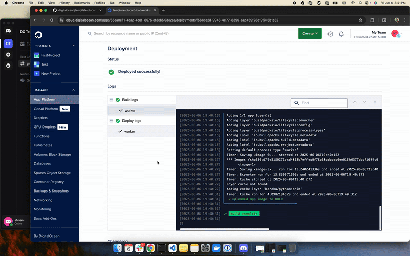

## Digitalocean Template Repos
This repository contains a template for a background worker process suitable for running a Discord bot.

 

**Note**: Following these steps may result in charges for the use of DigitalOcean services.

### Requirements

* You need a DigitalOcean account. If you do not already have one, first [sign up](https://cloud.digitalocean.com/registrations/new).
* You need to have created and configured a discord bot on the [Discord Developer Portal](https://discord.com/developers/applications).

## Deploying the App

Click this button to deploy the app to the DigitalOcean App Platform. If you are not logged in, you will be prompted to log in with your DigitalOcean account.

Using this button disables the ability to automatically re-deploy your app when pushing to a branch or tag in your repository as you are using this repo directly.

## How to Create and Configure a discord bot.
- Go to the Discord Developer Portal and add a new application. Go to the "Bot" settings and copy the token to use as your **DISCORD_TOKEN**.
- Under Bot Permissions, select the Text Permissions that you would like to allow for the bot. Enable "Message Content Intent".
- Go to OAuth2 settings and select "bot" from the Scopes. Again under Bot Permissions, select the Text Permissions that you would like to allow for the bot.
- At the bottom, copy the Generated URL and paste it into a new tab. Select the server you want to add the bot to and this will allow the bot to connect to your server.

## Learn More

To learn more about App Platform and how to manage and update your application, see [our App Platform documentation](https://www.digitalocean.com/docs/app-platform/).

## Delete the App

When you no longer need this sample application running live, you can delete it by following these steps:
1. Visit the [Apps control panel](https://cloud.digitalocean.com/apps).
2. Navigate to the sample app.
3. In the **Settings** tab, click **Destroy**.

**Note**: If you do not delete your app, charges for using DigitalOcean services will continue to accrue.